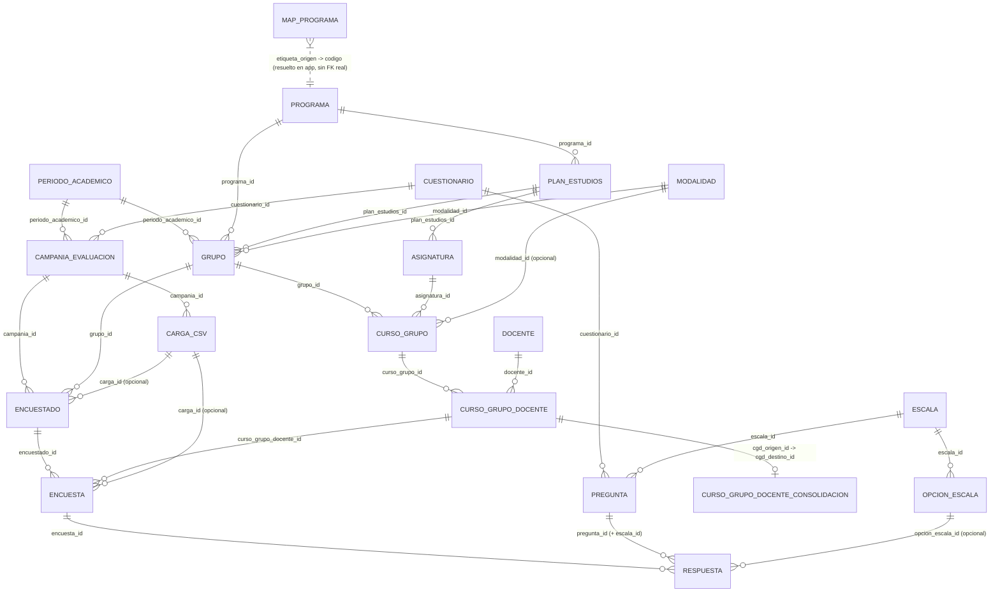

# Esquema de base de datos — Supabase (fca-survey-manager)

> Generado consultando directamente Postgres vía MCP de Supabase (`information_schema`, `pg_constraint`, `pg_indexes`, `pg_policies`) el 2026-08-04.
> Proyecto: `tqhqizvfehatfvmvwtsb` (región `ca-central-1`, Postgres 17.6).

## Índice

1. [Resumen y convenciones](#resumen-y-convenciones)
2. [Tablas del esquema `public`](#tablas-del-esquema-public)
3. [Esquema `staging` (carga de CSV)](#esquema-staging-carga-de-csv)
4. [Vistas (`v_*`)](#vistas-v_)
5. [Row Level Security](#row-level-security)
6. [Diagrama de relaciones](#diagrama-de-relaciones)
7. [Conteo de filas por tabla](#conteo-de-filas-por-tabla)
8. [Hallazgos: código vs. base de datos](#hallazgos-código-vs-base-de-datos)

---

## Resumen y convenciones

- **34 tablas** en `public`, **11 vistas** (`v_*`) en `public`, **10 tablas** en el esquema `staging` (usado solo durante la importación de CSV).
- Todas las tablas de `public` tienen RLS **activado**, excepto `carga_csv` (RLS desactivado). Donde hay RLS, la única política es lectura (`SELECT`) para el rol `authenticated`, sin políticas de `INSERT`/`UPDATE`/`DELETE` — es decir, las escrituras solo son posibles con la `service_role_key` (que bypasea RLS), que es justamente lo que usa el backend (`backend/src/config/supabase.js`).
- Los IDs son `smallint`, `bigint` según el volumen esperado de cada tabla (catálogos pequeños en `smallint`, tablas transaccionales en `bigint`).
- Varias tablas usan **claves foráneas compuestas** para forzar consistencia entre columnas relacionadas (ver `respuesta` más abajo).

---

## Tablas del esquema `public`

### ambiente
| Columna | Tipo | Nulo | Default |
|---|---|---|---|
| id | smallint | NOT NULL | |
| sede_id | smallint | NOT NULL | |
| codigo | text | NOT NULL | |
| capacidad | smallint | NULL | |
| activo | boolean | NOT NULL | true |

- **PK:** `id`
- **FK:** `sede_id` → `sede(id)`
- **UNIQUE:** `(sede_id, codigo)`
- **CHECK:** `ck_ambiente_capacidad`: `capacidad IS NULL OR capacidad > 0`
- **Índices:** solo los de PK/UNIQUE.
- **RLS:** activado, `SELECT` para `authenticated`.
- **Filas:** 21

### asignatura
| Columna | Tipo | Nulo | Default |
|---|---|---|---|
| id | bigint | NOT NULL | |
| plan_estudios_id | smallint | NOT NULL | |
| codigo | text | NULL | |
| nombre | text | NOT NULL | |
| clave_busqueda | text | NULL | |
| creditos | smallint | NULL | |
| ciclo | smallint | NULL | |
| es_electivo | boolean | NOT NULL | false |
| horas_teoria | smallint | NULL | |
| horas_practica | smallint | NULL | |
| sumilla | text | NULL | |
| activo | boolean | NOT NULL | true |
| created_at | timestamptz | NOT NULL | now() |
| updated_at | timestamptz | NOT NULL | now() |

- **PK:** `id`
- **FK:** `plan_estudios_id` → `plan_estudios(id)`
- **UNIQUE:** `uq_asignatura_plan_codigo (plan_estudios_id, codigo) WHERE codigo IS NOT NULL`; `uq_asignatura_plan_nombre (plan_estudios_id, clave_busqueda)`
- **CHECK:** `ck_asignatura_ciclo`: `ciclo IS NULL OR (ciclo BETWEEN 1 AND 10)`; `ck_asignatura_creditos`: `creditos IS NULL OR (creditos BETWEEN 1 AND 30)`
- **Índices:** `ix_asignatura_plan (plan_estudios_id)`; `ix_asignatura_busqueda_trgm` — GIN trigram sobre `clave_busqueda` (búsqueda difusa por nombre).
- **RLS:** activado, `SELECT` para `authenticated`.
- **Filas:** 111

### campania_evaluacion
| Columna | Tipo | Nulo | Default |
|---|---|---|---|
| id | smallint | NOT NULL | |
| periodo_academico_id | smallint | NOT NULL | |
| cuestionario_id | smallint | NOT NULL | |
| politica_evaluacion_id | smallint | NOT NULL | |
| codigo | text | NOT NULL | |
| fecha_apertura | date | NULL | |
| fecha_cierre | date | NULL | |
| estado | text | NOT NULL | 'BORRADOR' |
| created_at | timestamptz | NOT NULL | now() |
| updated_at | timestamptz | NOT NULL | now() |

- **PK:** `id`
- **FK:** `periodo_academico_id` → `periodo_academico(id)`; `cuestionario_id` → `cuestionario(id)`; `politica_evaluacion_id` → `politica_evaluacion(id)`
- **UNIQUE:** `codigo`; `uq_campania (periodo_academico_id, cuestionario_id)`
- **CHECK:** `ck_campania_estado`: `estado IN ('BORRADOR','ABIERTA','CERRADA','PUBLICADA')`; `ck_campania_fechas`: `fecha_cierre IS NULL OR fecha_apertura IS NULL OR fecha_apertura <= fecha_cierre`
- **RLS:** activado, `SELECT` para `authenticated`.
- **Filas:** 1

### carga_csv
| Columna | Tipo | Nulo | Default |
|---|---|---|---|
| id | bigint | NOT NULL | |
| campania_id | smallint | NOT NULL | |
| archivo_nombre | text | NOT NULL | |
| filas_leidas | integer | NOT NULL | 0 |
| filas_insertadas | integer | NOT NULL | 0 |
| filas_omitidas | integer | NOT NULL | 0 |
| filas_error | integer | NOT NULL | 0 |
| errores | jsonb | NULL | |
| omitidas | jsonb | NULL | |
| estado | text | NOT NULL | 'procesando' |
| mensaje_error | text | NULL | |
| fecha_carga | timestamptz | NOT NULL | now() |
| visible | boolean | NOT NULL | true |
| advertencias | jsonb | NULL | |

- **PK:** `id`
- **FK:** `campania_id` → `campania_evaluacion(id)`
- **CHECK:** `carga_csv_estado_check`: `estado IN ('procesando','completado','completado_con_errores','error')`
- **Índices:** `idx_carga_csv_campania (campania_id)`
- **RLS:** **desactivado** (única tabla de `public` sin RLS).
- **Filas:** 0
- Nota: `visible` controla si las encuestas/encuestados de esa carga se incluyen en las vistas de reporte (`v_encuesta_*`, `v_docente_*` filtran `carga_id IS NULL OR carga_csv.visible = true`).

### categoria_docente
| Columna | Tipo | Nulo | Default |
|---|---|---|---|
| id | smallint | NOT NULL | |
| codigo | text | NOT NULL | |
| nombre | text | NOT NULL | |
| orden | smallint | NOT NULL | |
| activo | boolean | NOT NULL | true |

- **PK:** `id` · **UNIQUE:** `codigo`, `nombre`, `orden` · **RLS:** activado, `SELECT` · **Filas:** 3

### condicion_docente
| Columna | Tipo | Nulo | Default |
|---|---|---|---|
| id | smallint | NOT NULL | |
| codigo | text | NOT NULL | |
| nombre | text | NOT NULL | |
| es_otra_facultad | boolean | NOT NULL | false |
| activo | boolean | NOT NULL | true |

- **PK:** `id` · **UNIQUE:** `codigo`, `nombre` · **RLS:** activado, `SELECT` · **Filas:** 3

### coordinacion_ciclo
| Columna | Tipo | Nulo | Default |
|---|---|---|---|
| id | bigint | NOT NULL | |
| periodo_academico_id | smallint | NOT NULL | |
| programa_id | smallint | NOT NULL | |
| ciclo | smallint | NOT NULL | |
| docente_id | bigint | NOT NULL | |

- **PK:** `id`
- **FK:** `periodo_academico_id` → `periodo_academico(id)`; `programa_id` → `programa(id)`; `docente_id` → `docente(id)`
- **UNIQUE:** `uq_coordinacion (periodo_academico_id, programa_id, ciclo)`
- **CHECK:** `ck_coordinacion_ciclo`: `ciclo BETWEEN 1 AND 10`
- **RLS:** activado, `SELECT` · **Filas:** 4

### cuestionario
| Columna | Tipo | Nulo | Default |
|---|---|---|---|
| id | smallint | NOT NULL | |
| codigo | text | NOT NULL | |
| nombre | text | NOT NULL | |
| version | smallint | NOT NULL | 1 |
| vigente_desde | date | NOT NULL | CURRENT_DATE |
| vigente_hasta | date | NULL | |
| activo | boolean | NOT NULL | true |

- **PK:** `id` · **UNIQUE:** `uq_cuestionario_codigo_version (codigo, version)`
- **CHECK:** `ck_cuestionario_vigencia`: `vigente_hasta IS NULL OR vigente_desde < vigente_hasta`
- **RLS:** activado, `SELECT` · **Filas:** 1

### curso_grupo
| Columna | Tipo | Nulo | Default |
|---|---|---|---|
| id | bigint | NOT NULL | |
| grupo_id | bigint | NOT NULL | |
| asignatura_id | bigint | NOT NULL | |
| turno_id | smallint | NULL | |
| modalidad_id | smallint | NULL | |
| estado | text | NOT NULL | 'PROGRAMADO' |
| created_at | timestamptz | NOT NULL | now() |
| updated_at | timestamptz | NOT NULL | now() |

- **PK:** `id`
- **FK:** `grupo_id` → `grupo(id)` **ON DELETE CASCADE**; `asignatura_id` → `asignatura(id)`; `turno_id` → `turno(id)`; `modalidad_id` → `modalidad(id)`
- **UNIQUE:** `uq_curso_grupo (grupo_id, asignatura_id)`
- **CHECK:** `ck_curso_grupo_estado`: `estado IN ('PROGRAMADO','EN_CURSO','CERRADO','ANULADO')`
- **Índices:** `ix_curso_grupo_asignatura (asignatura_id)`
- **RLS:** activado, `SELECT` · **Filas:** 300

### curso_grupo_docente
| Columna | Tipo | Nulo | Default |
|---|---|---|---|
| id | bigint | NOT NULL | |
| curso_grupo_id | bigint | NOT NULL | |
| docente_id | bigint | NOT NULL | |
| rol | text | NOT NULL | 'TITULAR' |
| porcentaje_carga | numeric | NOT NULL | 100 |
| es_carga_oficial | boolean | NOT NULL | true |
| created_at | timestamptz | NOT NULL | now() |
| updated_at | timestamptz | NOT NULL | now() |

- **PK:** `id`
- **FK:** `curso_grupo_id` → `curso_grupo(id)` **ON DELETE CASCADE**; `docente_id` → `docente(id)`
- **UNIQUE:** `uq_curso_grupo_docente (curso_grupo_id, docente_id)`
- **CHECK:** `ck_cgd_porcentaje`: `0 < porcentaje_carga <= 100`; `ck_cgd_rol`: `rol IN ('TITULAR','COTITULAR','INVITADO','JEFE_PRACTICA')`
- **Índices:** `ix_cgd_docente (docente_id)`; `ix_cgd_docente_curso (docente_id, curso_grupo_id)`
- **RLS:** activado, `SELECT` · **Filas:** 311

### curso_grupo_docente_consolidacion
Tabla puente que **redirige encuestas de una sección/docente "origen" hacia el `curso_grupo_docente` "destino"** real (p. ej. cuando dos secciones se dictan juntas y las encuestas se registraron contra la sección equivocada). Consumida por la vista `v_encuesta_seccion_efectiva`.

| Columna | Tipo | Nulo | Default |
|---|---|---|---|
| cgd_origen_id | bigint | NOT NULL | |
| cgd_destino_id | bigint | NOT NULL | |
| es_automatico | boolean | NOT NULL | true |
| motivo | text | NULL | |
| creado_por | text | NULL | |
| created_at | timestamptz | NOT NULL | now() |

- **PK:** `cgd_origen_id` (relación 1:1 desde el origen)
- **FK:** `cgd_origen_id` → `curso_grupo_docente(id)` **ON DELETE CASCADE**; `cgd_destino_id` → `curso_grupo_docente(id)` **ON DELETE CASCADE**
- **CHECK:** `ck_consol_no_autoreferencia`: `cgd_origen_id <> cgd_destino_id`
- **RLS:** activado, `SELECT` · **Filas:** 34

### dimension
Las 2 dimensiones del cuestionario (`DIM_I` = preguntas numéricas para la nota, `DIM_II` = preguntas categóricas Sí/No/A veces, "directivas").

| Columna | Tipo | Nulo | Default |
|---|---|---|---|
| id | smallint | NOT NULL | |
| codigo | text | NOT NULL | |
| nombre | text | NOT NULL | |
| descripcion | text | NULL | |
| orden | smallint | NOT NULL | |
| peso | numeric | NOT NULL | 1 |

- **PK:** `id` · **UNIQUE:** `codigo`, `orden` · **RLS:** activado, `SELECT` · **Filas:** 2

### docente
| Columna | Tipo | Nulo | Default |
|---|---|---|---|
| id | bigint | NOT NULL | |
| tipo_documento_id | smallint | NULL | |
| numero_documento | text | NULL | |
| codigo_docente | text | NULL | |
| apellido_paterno | text | NOT NULL | |
| apellido_materno | text | NULL | |
| nombres | text | NOT NULL | |
| nombre_completo | text | NULL | |
| clave_busqueda | text | NULL | |
| correo_institucional | text | NULL | |
| pais_id | smallint | NULL | |
| facultad_id | smallint | NULL | |
| grado_academico_id | smallint | NULL | |
| condicion_docente_id | smallint | NULL | |
| categoria_docente_id | smallint | NULL | |
| tiene_portafolio | boolean | NOT NULL | false |
| registrado_sunedu | boolean | NOT NULL | false |
| sunedu_r1 | boolean | NOT NULL | false |
| en_roster_encuestas | boolean | NOT NULL | false |
| enriquecido_padron | boolean | NOT NULL | false |
| activo | boolean | NOT NULL | true |
| created_at | timestamptz | NOT NULL | now() |
| updated_at | timestamptz | NOT NULL | now() |

- **PK:** `id`
- **FK:** `tipo_documento_id` → `tipo_documento(id)`; `pais_id` → `pais(id)`; `facultad_id` → `facultad(id)`; `grado_academico_id` → `grado_academico(id)`; `condicion_docente_id` → `condicion_docente(id)`; `categoria_docente_id` → `categoria_docente(id)`
- **UNIQUE:** `uq_docente_codigo (codigo_docente) WHERE codigo_docente IS NOT NULL`; `uq_docente_correo_institucional (lower(correo_institucional)) WHERE correo_institucional IS NOT NULL`; `uq_docente_documento (tipo_documento_id, numero_documento) WHERE numero_documento IS NOT NULL`
- **CHECK:** `ck_docente_correo_inst` (formato email); `ck_docente_documento_completo`: `(tipo_documento_id IS NULL) = (numero_documento IS NULL)` (ambos o ninguno); `ck_docente_numero_documento`: `numero_documento ~ '^[A-Za-z0-9]{6,20}$'`; `ck_docente_r1_implica_sunedu`: `NOT sunedu_r1 OR registrado_sunedu`
- **Índices:** `ix_docente_apellidos (apellido_paterno, apellido_materno, nombres)`; `ix_docente_clave_busqueda_trgm` (GIN trigram); `ix_docente_condicion (condicion_docente_id)`; `ix_docente_facultad (facultad_id)`
- **RLS:** activado, `SELECT` · **Filas:** 176

### docente_contacto
| Columna | Tipo | Nulo | Default |
|---|---|---|---|
| id | bigint | NOT NULL | |
| docente_id | bigint | NOT NULL | |
| tipo_contacto | text | NOT NULL | |
| valor | text | NOT NULL | |
| es_principal | boolean | NOT NULL | false |
| verificado | boolean | NOT NULL | false |
| created_at | timestamptz | NOT NULL | now() |
| updated_at | timestamptz | NOT NULL | now() |

- **PK:** `id`
- **FK:** `docente_id` → `docente(id)` **ON DELETE CASCADE**
- **UNIQUE:** `uq_docente_contacto (docente_id, tipo_contacto, valor)`; `uq_docente_contacto_principal (docente_id, tipo_contacto) WHERE es_principal` (solo un contacto principal por tipo)
- **CHECK:** `ck_contacto_tipo`: `tipo_contacto IN ('CORREO_INSTITUCIONAL','CORREO_PERSONAL','CELULAR','TELEFONO_FIJO','OTRO')`; `ck_contacto_valor`: valida formato email o numérico según `tipo_contacto`
- **Índices:** `ix_docente_contacto_docente (docente_id)`
- **RLS:** activado, `SELECT` · **Filas:** 460

### docente_gestion_periodo
Seguimiento del proceso de confirmación de datos con el docente en un período (envío de correo, confirmación, incidencias). No referenciada por ningún código de la app (ver hallazgos).

| Columna | Tipo | Nulo | Default |
|---|---|---|---|
| id | bigint | NOT NULL | |
| docente_periodo_id | bigint | NOT NULL | |
| fecha_envio_correo | date | NULL | |
| fecha_confirmacion | date | NULL | |
| tiene_problema | boolean | NOT NULL | false |
| responsable | text | NULL | |
| notas | text | NULL | |
| created_at | timestamptz | NOT NULL | now() |
| updated_at | timestamptz | NOT NULL | now() |

- **PK:** `id`
- **FK:** `docente_periodo_id` → `docente_periodo(id)` **ON DELETE CASCADE**
- **UNIQUE:** `docente_periodo_id` (1:1 con `docente_periodo`)
- **CHECK:** `ck_gestion_fechas`: `fecha_confirmacion IS NULL OR fecha_envio_correo IS NULL OR fecha_confirmacion >= fecha_envio_correo`
- **RLS:** activado, `SELECT` · **Filas:** 0

### docente_periodo
Snapshot de los datos de un docente **por período académico** (facultad, condición, categoría, grado pueden cambiar de un período a otro). No referenciada por ningún código de la app todavía.

| Columna | Tipo | Nulo | Default |
|---|---|---|---|
| id | bigint | NOT NULL | |
| docente_id | bigint | NOT NULL | |
| periodo_academico_id | smallint | NOT NULL | |
| condicion_docente_id | smallint | NOT NULL | |
| categoria_docente_id | smallint | NULL | |
| grado_academico_id | smallint | NULL | |
| facultad_id | smallint | NULL | |
| tiene_portafolio | boolean | NOT NULL | false |
| registrado_sunedu | boolean | NOT NULL | false |
| sunedu_r1 | boolean | NOT NULL | false |
| observacion | text | NULL | |
| created_at | timestamptz | NOT NULL | now() |
| updated_at | timestamptz | NOT NULL | now() |

- **PK:** `id`
- **FK:** `docente_id` → `docente(id)` **ON DELETE CASCADE**; `periodo_academico_id` → `periodo_academico(id)`; `condicion_docente_id` → `condicion_docente(id)`; `categoria_docente_id` → `categoria_docente(id)`; `grado_academico_id` → `grado_academico(id)`; `facultad_id` → `facultad(id)`
- **UNIQUE:** `uq_docente_periodo (docente_id, periodo_academico_id)`
- **Índices:** `ix_docente_periodo_periodo (periodo_academico_id)`
- **RLS:** activado, `SELECT` · **Filas:** 175

### encuesta
| Columna | Tipo | Nulo | Default |
|---|---|---|---|
| id | bigint | NOT NULL | |
| encuestado_id | bigint | NOT NULL | |
| curso_grupo_docente_id | bigint | NOT NULL | |
| fecha_respuesta | timestamptz | NOT NULL | now() |
| origen | text | NOT NULL | 'IMPORTACION' |
| created_at | timestamptz | NOT NULL | now() |
| carga_id | bigint | NULL | |

- **PK:** `id`
- **FK:** `encuestado_id` → `encuestado(id)` **ON DELETE CASCADE**; `curso_grupo_docente_id` → `curso_grupo_docente(id)`; `carga_id` → `carga_csv(id)`
- **UNIQUE:** `uq_encuesta (encuestado_id, curso_grupo_docente_id)` — un encuestado no puede evaluar dos veces al mismo docente/curso
- **CHECK:** `ck_encuesta_origen`: `origen IN ('WEB','PAPEL','IMPORTACION')`
- **Índices:** `idx_encuesta_carga (carga_id)`; `ix_encuesta_cgd (curso_grupo_docente_id)`; `ix_encuesta_fecha (fecha_respuesta)`
- **RLS:** activado, `SELECT` · **Filas:** 1,841

### encuestado
| Columna | Tipo | Nulo | Default |
|---|---|---|---|
| id | bigint | NOT NULL | |
| campania_id | smallint | NOT NULL | |
| grupo_id | bigint | NOT NULL | |
| codigo | text | NOT NULL | |
| secuencia | smallint | NOT NULL | 1 |
| fecha_registro | timestamptz | NOT NULL | now() |
| carga_id | bigint | NULL | |

- **PK:** `id`
- **FK:** `campania_id` → `campania_evaluacion(id)` **ON DELETE CASCADE**; `grupo_id` → `grupo(id)`; `carga_id` → `carga_csv(id)`
- **UNIQUE:** `uq_encuestado_campania_codigo (campania_id, codigo, secuencia)`; `uq_encuestado_id_grupo (id, grupo_id)` (soporte para FK compuestas desde otras tablas)
- **CHECK:** `ck_encuestado_secuencia`: `secuencia >= 1` — el mismo `codigo` (estudiante anónimo) puede repetirse con distinta `secuencia` si aparece en más de un grupo/carga.
- **Índices:** `idx_encuestado_carga (carga_id)`; `ix_encuestado_grupo (grupo_id)`
- **RLS:** activado, `SELECT` · **Filas:** 460

### escala
| Columna | Tipo | Nulo | Default |
|---|---|---|---|
| id | smallint | NOT NULL | |
| codigo | text | NOT NULL | |
| nombre | text | NOT NULL | |
| tipo | text | NOT NULL | |
| valor_min | smallint | NULL | |
| valor_max | smallint | NULL | |

- **PK:** `id` · **UNIQUE:** `codigo`; `uq_escala_id_tipo (id, tipo)` (soporte de FK compuesta desde `pregunta`/`respuesta`)
- **CHECK:** `ck_escala_rango`: si `tipo='NUMERICA'` requiere `valor_min < valor_max`; si `tipo='CATEGORICA'` ambos deben ser NULL; `ck_escala_tipo`: `tipo IN ('NUMERICA','CATEGORICA')`
- **RLS:** activado, `SELECT` · **Filas:** 2

### facultad
| Columna | Tipo | Nulo | Default |
|---|---|---|---|
| id | smallint | NOT NULL | |
| codigo | text | NOT NULL | |
| nombre | text | NOT NULL | |
| activo | boolean | NOT NULL | true |

- **PK:** `id` · **UNIQUE:** `codigo`, `nombre` · **RLS:** activado, `SELECT` · **Filas:** 21

### grado_academico
| Columna | Tipo | Nulo | Default |
|---|---|---|---|
| id | smallint | NOT NULL | |
| codigo | text | NOT NULL | |
| nombre | text | NOT NULL | |
| nivel | smallint | NOT NULL | |
| habilita_posgrado | boolean | NOT NULL | false |
| activo | boolean | NOT NULL | true |

- **PK:** `id` · **UNIQUE:** `codigo`, `nivel`, `nombre` · **RLS:** activado, `SELECT` · **Filas:** 5

### grupo
| Columna | Tipo | Nulo | Default |
|---|---|---|---|
| id | bigint | NOT NULL | |
| periodo_academico_id | smallint | NOT NULL | |
| programa_id | smallint | NOT NULL | |
| plan_estudios_id | smallint | NOT NULL | |
| ciclo | smallint | NOT NULL | |
| seccion | smallint | NOT NULL | |
| ambiente_id | smallint | NULL | |
| modalidad_id | smallint | NOT NULL | |
| num_matriculados | smallint | NULL | |
| created_at | timestamptz | NOT NULL | now() |
| updated_at | timestamptz | NOT NULL | now() |

- **PK:** `id`
- **FK:** `periodo_academico_id` → `periodo_academico(id)`; `programa_id` → `programa(id)`; `plan_estudios_id` → `plan_estudios(id)`; `ambiente_id` → `ambiente(id)`; `modalidad_id` → `modalidad(id)`
- **UNIQUE:** `uq_grupo (periodo_academico_id, programa_id, ciclo, seccion)`
- **CHECK:** `ck_grupo_ciclo`: `ciclo BETWEEN 1 AND 10`; `ck_grupo_matriculados`: `num_matriculados IS NULL OR >= 0`; `ck_grupo_seccion`: `seccion BETWEEN 1 AND 50`
- **Índices:** `ix_grupo_filtros (periodo_academico_id, programa_id, ciclo, seccion)`; `ix_grupo_periodo (periodo_academico_id)`; `ix_grupo_programa (programa_id, ciclo)`
- **RLS:** activado, `SELECT` · **Filas:** 64

### modalidad
| Columna | Tipo | Nulo | Default |
|---|---|---|---|
| id | smallint | NOT NULL | |
| codigo | text | NOT NULL | |
| nombre | text | NOT NULL | |
| activo | boolean | NOT NULL | true |

- **PK:** `id` · **UNIQUE:** `codigo`, `nombre` · **RLS:** activado, `SELECT` · **Filas:** 3

### nivel_programa
| Columna | Tipo | Nulo | Default |
|---|---|---|---|
| id | smallint | NOT NULL | |
| codigo | text | NOT NULL | |
| nombre | text | NOT NULL | |
| activo | boolean | NOT NULL | true |

- **PK:** `id` · **UNIQUE:** `codigo`, `nombre` · **RLS:** activado, `SELECT` · **Filas:** 3

### opcion_escala
| Columna | Tipo | Nulo | Default |
|---|---|---|---|
| id | smallint | NOT NULL | |
| escala_id | smallint | NOT NULL | |
| codigo | text | NOT NULL | |
| etiqueta | text | NOT NULL | |
| valor_equivalente | numeric | NULL | |
| orden | smallint | NOT NULL | |
| es_favorable | boolean | NOT NULL | false |

- **PK:** `id`
- **FK:** `escala_id` → `escala(id)` **ON DELETE CASCADE**
- **UNIQUE:** `uq_opcion_escala_codigo (escala_id, codigo)`; `uq_opcion_escala_orden (escala_id, orden)`; `uq_opcion_id_escala (id, escala_id)` (soporte FK compuesta)
- **RLS:** activado, `SELECT` · **Filas:** 3

### pais
| Columna | Tipo | Nulo | Default |
|---|---|---|---|
| id | smallint | NOT NULL | |
| codigo_iso | char(3) | NOT NULL | |
| nombre | text | NOT NULL | |
| activo | boolean | NOT NULL | true |

- **PK:** `id` · **UNIQUE:** `codigo_iso`, `nombre` · **RLS:** activado, `SELECT` · **Filas:** 8

### periodo_academico
| Columna | Tipo | Nulo | Default |
|---|---|---|---|
| id | smallint | NOT NULL | |
| codigo | text | NOT NULL | |
| anio | smallint | NOT NULL | |
| semestre | smallint | NOT NULL | |
| fecha_inicio | date | NULL | |
| fecha_fin | date | NULL | |
| estado | text | NOT NULL | 'PLANIFICADO' |

- **PK:** `id` · **UNIQUE:** `codigo`; `uq_periodo_anio_sem (anio, semestre)`
- **CHECK:** `ck_periodo_anio`: `anio BETWEEN 1990 AND 2100`; `ck_periodo_estado`: `estado IN ('PLANIFICADO','EN_CURSO','CERRADO')`; `ck_periodo_fechas`: `fecha_fin IS NULL OR fecha_inicio IS NULL OR fecha_inicio < fecha_fin`; `ck_periodo_semestre`: `semestre BETWEEN 1 AND 3`
- **RLS:** activado, `SELECT` · **Filas:** 1

### plan_estudios
| Columna | Tipo | Nulo | Default |
|---|---|---|---|
| id | smallint | NOT NULL | |
| programa_id | smallint | NOT NULL | |
| anio | smallint | NOT NULL | |
| resolucion | text | NULL | |
| vigente_desde | date | NULL | |
| vigente_hasta | date | NULL | |
| total_creditos | smallint | NULL | |
| activo | boolean | NOT NULL | true |

- **PK:** `id`
- **FK:** `programa_id` → `programa(id)`
- **UNIQUE:** `uq_plan_programa_anio (programa_id, anio)`
- **CHECK:** `ck_plan_anio`: `anio BETWEEN 1990 AND 2100`; `ck_plan_vigencia`: `vigente_hasta IS NULL OR vigente_desde IS NULL OR vigente_desde < vigente_hasta`
- **RLS:** activado, `SELECT` · **Filas:** 16

### politica_evaluacion
Parámetros de conversión de respuestas a nota vigesimal y umbrales de alerta, referenciados por `campania_evaluacion` y usados en las vistas `v_encuesta_nota` / `v_promedio_por_criterio` / `v_seguimiento`. Expuesta de solo lectura vía `GET /api/politica-evaluacion` — es la fuente única de estos umbrales, el frontend ya no los hardcodea (ver migración `2026-08-04-unificar-umbral-seguimiento-nota.sql`).

| Columna | Tipo | Nulo | Default |
|---|---|---|---|
| id | smallint | NOT NULL | |
| codigo | text | NOT NULL | |
| nota_maxima | numeric | NOT NULL | 20 |
| factor_conversion | numeric | NOT NULL | 2 |
| umbral_aprobacion | numeric | NOT NULL | 14 |
| umbral_seguimiento_pct_no | numeric | NOT NULL | 30 |
| umbral_critico_pct_no | numeric | NOT NULL | 45 |
| min_encuestas_validas | smallint | NOT NULL | 1 |

- **PK:** `id` · **UNIQUE:** `codigo`
- **CHECK:** `ck_politica_umbrales`: `umbral_aprobacion <= nota_maxima AND umbral_seguimiento_pct_no <= umbral_critico_pct_no`
- **RLS:** activado, `SELECT` · **Filas:** 1
- **Nota histórica:** existió una columna `umbral_seguimiento_nota` (11) separada de `umbral_aprobacion` (14), usada solo por `v_seguimiento` -- se eliminó porque no correspondía a ninguna regla de negocio real (cualquier docente desaprobado, nota < `umbral_aprobacion`, debe aparecer en seguimiento).

### pregunta
| Columna | Tipo | Nulo | Default |
|---|---|---|---|
| id | smallint | NOT NULL | |
| cuestionario_id | smallint | NOT NULL | |
| dimension_id | smallint | NOT NULL | |
| escala_id | smallint | NOT NULL | |
| codigo | text | NOT NULL | |
| enunciado | text | NOT NULL | |
| etiqueta_corta | text | NULL | |
| orden | smallint | NOT NULL | |
| obligatoria | boolean | NOT NULL | false |
| activa | boolean | NOT NULL | true |

- **PK:** `id`
- **FK:** `cuestionario_id` → `cuestionario(id)` **ON DELETE CASCADE**; `dimension_id` → `dimension(id)`; `escala_id` → `escala(id)`
- **UNIQUE:** `uq_pregunta_codigo (cuestionario_id, codigo)`; `uq_pregunta_orden (cuestionario_id, orden)`; `uq_pregunta_id_escala (id, escala_id)` (soporte FK compuesta desde `respuesta`)
- **Índices:** `ix_pregunta_cuestionario (cuestionario_id, orden)`
- **RLS:** activado, `SELECT` · **Filas:** 9

### programa
| Columna | Tipo | Nulo | Default |
|---|---|---|---|
| id | smallint | NOT NULL | |
| codigo | text | NOT NULL | |
| nivel_programa_id | smallint | NOT NULL | |
| nombre_base | text | NOT NULL | |
| mencion | text | NULL | |
| nombre_corto | text | NOT NULL | |
| activo | boolean | NOT NULL | true |
| created_at | timestamptz | NOT NULL | now() |
| updated_at | timestamptz | NOT NULL | now() |

- **PK:** `id`
- **FK:** `nivel_programa_id` → `nivel_programa(id)`
- **UNIQUE:** `codigo`; `uq_programa_base_mencion (fn_normaliza_texto(nombre_base), COALESCE(fn_normaliza_texto(mencion), ''))` — índice funcional que evita duplicados por variaciones de tildes/mayúsculas usando la función `fn_normaliza_texto`.
- **RLS:** activado, `SELECT` · **Filas:** 9

### respuesta
Tabla de mayor volumen del modelo transaccional (16,569 filas). Usa **PK compuesta** y **FKs compuestas** para garantizar que `pregunta_id`/`opcion_escala_id`/`escala_tipo` sean siempre consistentes con la `escala_id` de la pregunta.

| Columna | Tipo | Nulo | Default |
|---|---|---|---|
| encuesta_id | bigint | NOT NULL | |
| pregunta_id | smallint | NOT NULL | |
| escala_id | smallint | NOT NULL | |
| escala_tipo | text | NOT NULL | |
| valor_numerico | numeric | NULL | |
| opcion_escala_id | smallint | NULL | |
| respondida | boolean | NULL | |

- **PK:** `pk_respuesta (encuesta_id, pregunta_id)`
- **FK:** `encuesta_id` → `encuesta(id)` **ON DELETE CASCADE**; `pregunta_id` → `pregunta(id)`; `fk_respuesta_pregunta_escala`: `(pregunta_id, escala_id)` → `pregunta(id, escala_id)`; `fk_respuesta_escala_tipo`: `(escala_id, escala_tipo)` → `escala(id, tipo)`; `fk_respuesta_opcion_escala`: `(opcion_escala_id, escala_id)` → `opcion_escala(id, escala_id)`
- **CHECK:** `ck_respuesta_valor_por_tipo`: o bien ambos `valor_numerico`/`opcion_escala_id` son NULL, o bien `escala_tipo='NUMERICA'` con `valor_numerico` no nulo y `opcion_escala_id` nulo, o bien `escala_tipo='CATEGORICA'` con `opcion_escala_id` no nulo y `valor_numerico` nulo.
- **Índices:** `ix_respuesta_opcion (opcion_escala_id) WHERE opcion_escala_id IS NOT NULL`; `ix_respuesta_pregunta (pregunta_id)`; `ix_respuesta_sin_responder (encuesta_id) WHERE NOT respondida` (parcial, para localizar rápido preguntas sin responder).
- **RLS:** activado, `SELECT` · **Filas:** 16,569

### sede
| Columna | Tipo | Nulo | Default |
|---|---|---|---|
| id | smallint | NOT NULL | |
| codigo | text | NOT NULL | |
| nombre | text | NOT NULL | |
| direccion | text | NULL | |
| activo | boolean | NOT NULL | true |

- **PK:** `id` · **UNIQUE:** `codigo` · **RLS:** activado, `SELECT` · **Filas:** 1

### tipo_documento
| Columna | Tipo | Nulo | Default |
|---|---|---|---|
| id | smallint | NOT NULL | |
| codigo | text | NOT NULL | |
| nombre | text | NOT NULL | |
| longitud_min | smallint | NULL | |
| longitud_max | smallint | NULL | |
| activo | boolean | NOT NULL | true |

- **PK:** `id` · **UNIQUE:** `codigo`, `nombre`
- **CHECK:** `ck_tipo_documento_longitud`: `longitud_min IS NULL OR longitud_max IS NULL OR longitud_min <= longitud_max`
- **RLS:** activado, `SELECT` · **Filas:** 4

### turno
| Columna | Tipo | Nulo | Default |
|---|---|---|---|
| id | smallint | NOT NULL | |
| codigo | text | NOT NULL | |
| nombre | text | NOT NULL | |
| activo | boolean | NOT NULL | true |

- **PK:** `id` · **UNIQUE:** `codigo`, `nombre` · **RLS:** activado, `SELECT` · **Filas:** 4

---

## Esquema `staging` (carga de CSV)

Tablas de trabajo usadas exclusivamente por el flujo de importación (`backend/src/services/importarEncuestas.js` y, presumiblemente, procesos de ETL manuales/SQL para el padrón y roster). No tienen RLS ni FKs — son de vida corta / semilla. No se pidió el detalle de constraints para este esquema, se listan columnas para referencia:

| Tabla | Columnas | Uso |
|---|---|---|
| `map_programa` | `etiqueta_origen text NOT NULL`, `programa_codigo text NOT NULL` | Mapea el nombre de programa tal como viene en el CSV al `codigo` real de `programa`. **Usada por el código** (`importarEncuestas.js:11`, vía `supabase.schema('staging')`). |
| `map_condicion` | `etiqueta_origen text NOT NULL`, `condicion_codigo text NOT NULL` | Mapeo de condición docente origen→código. No referenciada en `backend/src` actual. |
| `map_grado` | `etiqueta_origen text NOT NULL`, `grado_codigo text NOT NULL` | Mapeo de grado académico origen→código. No referenciada en `backend/src` actual. |
| `cuarentena_correo` | `origen`, `docente`, `valor`, `motivo` (todo `text`) | Registro de correos rechazados/dudosos durante import. No referenciada en `backend/src`. |
| `reporte_calidad` | `verificacion text`, `severidad text`, `n_casos bigint`, `detalle text` | Reporte de calidad de datos post-carga. No referenciada en `backend/src`. |
| `stg_carga` | 22 columnas texto (`programa`, `docente`, `dni`, `plan`, `cod_asignatura`, `asignatura`, `ciclo`, `seccion`, `modalidad`, `turno`, etc.) | Staging crudo de la carga de asignación docente/curso. No referenciada en `backend/src`. |
| `stg_docente_roster` | `facultad`, `condicion`, `ap_paterno`, `ap_materno`, `nombres`, `correo`, `grado`, `tipo_doc`, `num_doc` (todo `text`) | Staging del roster de docentes. No referenciada en `backend/src`. |
| `stg_padron` | `facultad`, `item`, `cod_docente`, `ap_paterno`, `ap_materno`, `nombres`, `correo`, `categoria`, `grado`, `tipo_doc`, `num_doc`, `nacionalidad` (todo `text`) | Staging del padrón oficial de docentes. No referenciada en `backend/src`. |
| `stg_encuesta` | `programa`, `ciclo`, `seccion`, `aula`, `codigo`, `ap_paterno`, `ap_materno`, `nombres`, `curso`, `p1`..`p9` (todo `text`) | Staging crudo del CSV de encuestas antes de normalizar. No referenciada en `backend/src`. |
| `tmp_encuesta` | Igual que `stg_encuesta` + `n_respuestas int`, `k_docente text`, `k_curso text`, `secuencia bigint`, `programa_id smallint`, `grupo_id bigint`, `curso_grupo_docente_id bigint` | Staging intermedio ya enlazado con IDs reales, probablemente usado por un proceso SQL de matching (no visible en `backend/src`, posiblemente ejecutado manualmente o vía función/RPC no incluida en el repo). |

> Estas tablas confirman que **la importación real hoy pasa en gran parte por SQL directo / funciones de Postgres**, no solo por `importarEncuestas.js`: el servicio de Node solo usa `map_programa`, el resto del pipeline de `stg_*`/`tmp_encuesta` no tiene contraparte en el código JS del repo. Si ese proceso vive en funciones de Postgres, valdría la pena documentarlas aparte (no se pidieron en este alcance, pero se puede extraer con `pg_get_functiondef` si hace falta).

---

## Vistas (`v_*`)

Todas las vistas viven en `public`, son de solo lectura (no `INSERT`/`UPDATE`), y casi todas replican el mismo patrón: `WHERE e.carga_id IS NULL OR cc.visible = true` para que una carga CSV marcada como no-visible no contamine los reportes.

### v_docente_ficha
Usada por `GET /docentes` y `GET /docentes/:id` (`backend/src/controllers/docentes.js`).
```sql
SELECT d.id,
    d.nombre_completo,
    d.numero_documento,
    d.codigo_docente,
    td.nombre AS tipo_documento,
    f.nombre AS facultad,
    cd.nombre AS condicion,
    cd.es_otra_facultad,
    cat.nombre AS categoria_carrera,
    ga.nombre AS grado_academico,
    d.correo_institucional,
    d.tiene_portafolio,
    d.registrado_sunedu,
    d.sunedu_r1,
    d.en_roster_encuestas,
    d.enriquecido_padron,
    (SELECT count(*) FROM curso_grupo_docente x WHERE x.docente_id = d.id) AS cursos_asignados
FROM docente d
LEFT JOIN tipo_documento td ON td.id = d.tipo_documento_id
LEFT JOIN facultad f ON f.id = d.facultad_id
LEFT JOIN condicion_docente cd ON cd.id = d.condicion_docente_id
LEFT JOIN categoria_docente cat ON cat.id = d.categoria_docente_id
LEFT JOIN grado_academico ga ON ga.id = d.grado_academico_id;
```

### v_docente_seccion_consolidada
Usada por `GET /encuestas/consolidado` (`obtenerConsolidado`) y por la ficha de docente (`obtenerDocentePorId`).
```sql
SELECT d.id AS docente_id,
    d.nombre_completo,
    a.nombre AS asignatura,
    a.id AS asignatura_id,
    cg.id AS curso_grupo_id,
    pr.id AS programa_id,
    pr.nombre_corto AS programa,
    g.id AS grupo_id,
    g.ciclo,
    g.seccion,
    am.codigo AS aula,
    count(DISTINCT ef.encuesta_id) AS n_encuestas,
    count(DISTINCT ef.encuesta_id) FILTER (WHERE vn.nota_final IS NOT NULL) AS n_encuestas_validas,
    round(avg(vn.nota_final), 1) AS nota_promedio,
    round((100.0 * sum(vd2.n_si)) / NULLIF(sum(vd2.total), 0), 0) AS pct_si,
    string_agg(DISTINCT (og.ciclo || '-' || og.seccion), ', ' ORDER BY (og.ciclo || '-' || og.seccion)) AS secciones_origen
FROM v_encuesta_seccion_efectiva ef
JOIN curso_grupo_docente cgd ON cgd.id = ef.cgd_efectivo
JOIN curso_grupo cg ON cg.id = cgd.curso_grupo_id
JOIN grupo g ON g.id = cg.grupo_id
JOIN programa pr ON pr.id = g.programa_id
JOIN asignatura a ON a.id = cg.asignatura_id
JOIN docente d ON d.id = cgd.docente_id
LEFT JOIN ambiente am ON am.id = g.ambiente_id
JOIN curso_grupo_docente ocgd ON ocgd.id = ef.cgd_original
JOIN curso_grupo ocg ON ocg.id = ocgd.curso_grupo_id
JOIN grupo og ON og.id = ocg.grupo_id
LEFT JOIN v_encuesta_nota vn ON vn.encuesta_id = ef.encuesta_id
LEFT JOIN (
    SELECT encuesta_id, sum(total) AS total, sum(n_si) AS n_si
    FROM v_encuesta_directivas GROUP BY encuesta_id
) vd2 ON vd2.encuesta_id = ef.encuesta_id
GROUP BY d.id, d.nombre_completo, a.nombre, a.id, cg.id, pr.id, pr.nombre_corto, g.id, g.ciclo, g.seccion, am.codigo;
```

### v_docente_promedio_historico
Usada por la ficha de docente (histórico por período).
```sql
SELECT cgd.docente_id,
    p.codigo AS periodo,
    round(avg(r.valor_numerico) * 2, 1) AS promedio
FROM encuesta e
JOIN curso_grupo_docente cgd ON e.curso_grupo_docente_id = cgd.id
JOIN curso_grupo cg ON cgd.curso_grupo_id = cg.id
JOIN grupo g ON cg.grupo_id = g.id
JOIN periodo_academico p ON g.periodo_academico_id = p.id
JOIN respuesta r ON e.id = r.encuesta_id
LEFT JOIN carga_csv cc ON cc.id = e.carga_id
WHERE r.respondida = true AND r.escala_tipo = 'NUMERICA' AND (e.carga_id IS NULL OR cc.visible = true)
GROUP BY cgd.docente_id, p.codigo;
```

### v_promedio_por_criterio
Usada por `GET /encuestas/criterios` (`obtenerCriterios`).
```sql
SELECT cgd.docente_id,
    cg.grupo_id,
    cg.asignatura_id,
    g.programa_id,
    g.ciclo,
    g.seccion,
    p.id AS pregunta_id,
    p.codigo AS pregunta_codigo,
    p.etiqueta_corta,
    count(*) FILTER (WHERE r.respondida) AS n,
    round(avg(r.valor_numerico) * pol.factor_conversion, 2) AS promedio_vigesimal
FROM respuesta r
JOIN pregunta p ON p.id = r.pregunta_id
JOIN dimension d ON d.id = p.dimension_id AND d.codigo = 'DIM_I'
JOIN encuesta e ON e.id = r.encuesta_id
JOIN encuestado en ON en.id = e.encuestado_id
JOIN grupo g ON g.id = en.grupo_id
JOIN campania_evaluacion ca ON ca.id = en.campania_id
JOIN politica_evaluacion pol ON pol.id = ca.politica_evaluacion_id
JOIN curso_grupo_docente cgd ON cgd.id = e.curso_grupo_docente_id
JOIN curso_grupo cg ON cg.id = cgd.curso_grupo_id
LEFT JOIN carga_csv cc ON cc.id = e.carga_id
WHERE e.carga_id IS NULL OR cc.visible = true
GROUP BY cgd.docente_id, cg.grupo_id, cg.asignatura_id, g.programa_id, g.ciclo, g.seccion, p.id, p.codigo, p.etiqueta_corta, p.orden
ORDER BY p.orden;
```

### v_encuesta_directivas
Usada por `GET /encuestas/directivas` (`obtenerDirectivas`) y por `v_docente_seccion_consolidada`/`v_docente_curso_consolidado` para calcular `pct_si`. Solo considera preguntas de `DIM_II`.
```sql
SELECT e.id AS encuesta_id,
    cgd.docente_id,
    cg.asignatura_id,
    cg.grupo_id,
    g.programa_id,
    g.ciclo,
    g.seccion,
    p.codigo AS pregunta_codigo,
    p.etiqueta_corta,
    count(*) FILTER (WHERE r.respondida) AS total,
    count(*) FILTER (WHERE o.codigo = 'SI') AS n_si,
    count(*) FILTER (WHERE o.codigo = 'NO') AS n_no,
    count(*) FILTER (WHERE o.codigo = 'A_VECES') AS n_a_veces,
    count(*) FILTER (WHERE NOT r.respondida) AS n_sin_responder
FROM encuesta e
JOIN encuestado en ON en.id = e.encuestado_id
JOIN grupo g ON g.id = en.grupo_id
JOIN curso_grupo_docente cgd ON cgd.id = e.curso_grupo_docente_id
JOIN curso_grupo cg ON cg.id = cgd.curso_grupo_id
JOIN respuesta r ON r.encuesta_id = e.id
JOIN pregunta p ON p.id = r.pregunta_id
JOIN dimension d ON d.id = p.dimension_id AND d.codigo = 'DIM_II'
LEFT JOIN opcion_escala o ON o.id = r.opcion_escala_id
LEFT JOIN carga_csv cc ON cc.id = e.carga_id
WHERE e.carga_id IS NULL OR cc.visible = true
GROUP BY e.id, cgd.docente_id, cg.asignatura_id, cg.grupo_id, g.programa_id, g.ciclo, g.seccion, p.codigo, p.etiqueta_corta, p.orden
ORDER BY p.orden;
```

### v_respuesta_detalle
Usada por `GET /encuestas/respuestas` (`obtenerRespuestas`, filtrable por `docente_id`, `asignatura_id`, `grupo_id`).
```sql
SELECT e.id AS encuesta_id,
    en.codigo AS codigo_encuestado,
    en.secuencia,
    cgd.docente_id,
    cg.asignatura_id,
    cg.grupo_id,
    g.ciclo,
    g.seccion,
    p.codigo AS pregunta_codigo,
    p.etiqueta_corta,
    r.valor_numerico,
    o.etiqueta AS opcion_etiqueta,
    r.respondida
FROM respuesta r
JOIN encuesta e ON e.id = r.encuesta_id
JOIN encuestado en ON en.id = e.encuestado_id
JOIN curso_grupo_docente cgd ON cgd.id = e.curso_grupo_docente_id
JOIN curso_grupo cg ON cg.id = cgd.curso_grupo_id
JOIN grupo g ON g.id = cg.grupo_id
JOIN pregunta p ON p.id = r.pregunta_id
LEFT JOIN opcion_escala o ON o.id = r.opcion_escala_id
LEFT JOIN carga_csv cc ON cc.id = e.carga_id
WHERE e.carga_id IS NULL OR cc.visible = true;
```

### v_encuesta_nota (auxiliar, sin uso directo en el código)
Calcula la nota vigesimal de cada encuesta individual a partir de `DIM_I`. Usada internamente por `v_docente_seccion_consolidada`, `v_docente_curso_consolidado` y `v_promedio_por_criterio`.
```sql
SELECT e.id AS encuesta_id,
    e.encuestado_id,
    e.curso_grupo_docente_id,
    en.grupo_id AS grupo_estudiante_id,
    count(*) FILTER (WHERE r.respondida) AS criterios_respondidos,
    count(*) AS criterios_totales,
    round(avg(r.valor_numerico) * pol.factor_conversion, 1) AS nota_final,
    round(avg(r.valor_numerico) * pol.factor_conversion, 1) >= pol.umbral_aprobacion AS aprobado
FROM encuesta e
JOIN encuestado en ON en.id = e.encuestado_id
JOIN campania_evaluacion c ON c.id = en.campania_id
JOIN politica_evaluacion pol ON pol.id = c.politica_evaluacion_id
JOIN respuesta r ON r.encuesta_id = e.id
JOIN pregunta p ON p.id = r.pregunta_id
JOIN dimension d ON d.id = p.dimension_id
LEFT JOIN carga_csv cc ON cc.id = e.carga_id
WHERE d.codigo = 'DIM_I' AND (e.carga_id IS NULL OR cc.visible = true)
GROUP BY e.id, e.encuestado_id, e.curso_grupo_docente_id, en.grupo_id, pol.factor_conversion, pol.umbral_aprobacion;
```

### v_encuesta_seccion_efectiva (auxiliar, sin uso directo en el código)
Resuelve, para cada encuesta, cuál es el `curso_grupo_docente` "efectivo" tras aplicar la consolidación de `curso_grupo_docente_consolidacion`. Usada internamente por `v_docente_seccion_consolidada`.
```sql
SELECT e.id AS encuesta_id,
    cgd.id AS cgd_original,
    COALESCE(con.cgd_destino_id, cgd.id) AS cgd_efectivo
FROM encuesta e
JOIN curso_grupo_docente cgd ON cgd.id = e.curso_grupo_docente_id
LEFT JOIN curso_grupo_docente_consolidacion con ON con.cgd_origen_id = cgd.id
LEFT JOIN carga_csv cc ON cc.id = e.carga_id
WHERE e.carga_id IS NULL OR cc.visible = true;
```

### v_docente_curso_consolidado (sin uso detectado en el código)
Igual a `v_docente_seccion_consolidada` pero agregado por asignatura en vez de por sección/grupo específico.
```sql
SELECT cgd.docente_id,
    d.nombre_completo,
    cg.asignatura_id,
    a.nombre AS asignatura,
    pr.nombre_corto AS programa,
    count(DISTINCT e.id) AS n_encuestas,
    round(avg(vn.nota_final), 1) AS nota_promedio,
    round((100.0 * sum(vd2.n_si)) / NULLIF(sum(vd2.total), 0), 0) AS pct_si,
    string_agg(DISTINCT (g.ciclo || '-' || g.seccion), ', ' ORDER BY (g.ciclo || '-' || g.seccion)) AS origen_encuestas
FROM encuesta e
JOIN encuestado en ON en.id = e.encuestado_id
JOIN grupo g ON g.id = en.grupo_id
JOIN curso_grupo_docente cgd ON cgd.id = e.curso_grupo_docente_id
JOIN curso_grupo cg ON cg.id = cgd.curso_grupo_id
JOIN asignatura a ON a.id = cg.asignatura_id
JOIN programa pr ON pr.id = g.programa_id
JOIN docente d ON d.id = cgd.docente_id
LEFT JOIN v_encuesta_nota vn ON vn.encuesta_id = e.id
LEFT JOIN (
    SELECT encuesta_id, sum(total) AS total, sum(n_si) AS n_si
    FROM v_encuesta_directivas GROUP BY encuesta_id
) vd2 ON vd2.encuesta_id = e.id
LEFT JOIN carga_csv cc ON cc.id = e.carga_id
WHERE e.carga_id IS NULL OR cc.visible = true
GROUP BY cgd.docente_id, d.nombre_completo, cg.asignatura_id, a.nombre, pr.nombre_corto;
```

### v_tasa_respuesta_pregunta (sin uso detectado en el código)
Tasa de respuesta (% de `respondida = true`) por pregunta y campaña.
```sql
SELECT ca.id AS campania_id,
    p.id AS pregunta_id,
    p.codigo AS pregunta,
    p.etiqueta_corta,
    d.codigo AS dimension,
    count(*) AS n_encuestas,
    count(*) FILTER (WHERE r.respondida) AS n_respondidas,
    round((100.0 * count(*) FILTER (WHERE r.respondida)) / NULLIF(count(*), 0), 1) AS pct_respuesta
FROM respuesta r
JOIN pregunta p ON p.id = r.pregunta_id
JOIN dimension d ON d.id = p.dimension_id
JOIN encuesta e ON e.id = r.encuesta_id
JOIN encuestado en ON en.id = e.encuestado_id
JOIN campania_evaluacion ca ON ca.id = en.campania_id
LEFT JOIN carga_csv cc ON cc.id = e.carga_id
WHERE e.carga_id IS NULL OR cc.visible = true
GROUP BY ca.id, p.id, p.codigo, p.etiqueta_corta, d.codigo, p.orden
ORDER BY ca.id, p.orden;
```

### v_grupo_aula (sin uso detectado en el código)
Resuelve el nombre de aula/modalidad a mostrar para un grupo.
```sql
SELECT g.id AS grupo_id,
    g.programa_id,
    g.ciclo,
    g.seccion,
    m.codigo AS modalidad,
    CASE
        WHEN amb.codigo IS NOT NULL THEN amb.codigo
        WHEN m.codigo = 'VIRTUAL' THEN 'Virtual'
        ELSE 'Sin asignar'
    END AS aula_display
FROM grupo g
JOIN modalidad m ON m.id = g.modalidad_id
LEFT JOIN ambiente amb ON amb.id = g.ambiente_id;
```

---

## Row Level Security

- **RLS activo en 33 de las 34 tablas de `public`.** Única excepción: `carga_csv` (RLS desactivado por completo — cualquier rol con acceso a la tabla puede leer/escribir sin restricción de política).
- **Una sola política por tabla**, siempre igual: `p_lectura_autenticados` — `PERMISSIVE`, rol `authenticated`, comando `SELECT`, condición `true` (sin restricción de filas).
- **No existen políticas de `INSERT`, `UPDATE` ni `DELETE`** en ninguna tabla. Combinado con lo anterior:
  - Un usuario autenticado por Supabase Auth (JWT `authenticated`) solo puede leer, nunca escribir, en cualquier tabla de `public`.
  - El backend (`backend/src/config/supabase.js`) usa la `service_role_key`, que **bypasea RLS por completo** — así es como el CSV importer y los controladores logran escribir/leer sin restricción.
  - Como hoy no hay autenticación de usuarios implementada en el proyecto (nota explícita en `docentes.js`), en la práctica RLS no está protegiendo nada activamente todavía: el único cliente real es el backend con `service_role`.
- El frontend no debe recibir nunca la `service_role_key`; si en el futuro el frontend habla directo con Supabase (hoy no lo hace — pasa todo por el backend Express), debería usar la `anon`/`authenticated` key y las políticas de solo-lectura actuales aplicarían.

---

## Diagrama de relaciones



Notas sobre el diagrama:
- `map_programa` vive en el esquema `staging`, no tiene FK real hacia `programa` — el mapeo `etiqueta_origen → programa_codigo` se resuelve en código (`importarEncuestas.js`), por eso la relación se dibuja punteada.
- `curso_grupo_docente_consolidacion` es 1:1 opcional desde `curso_grupo_docente` (origen) hacia otro `curso_grupo_docente` (destino) — se omitieron por claridad `dimension`, `politica_evaluacion` y los catálogos de docente (`facultad`, `condicion_docente`, `categoria_docente`, `grado_academico`, `tipo_documento`, `pais`), todos FK simples 1:N hacia `docente` o `pregunta`.

---

## Conteo de filas por tabla

| Tabla | Filas | Tabla | Filas |
|---|---:|---|---:|
| respuesta | 16,569 | grupo | 64 |
| encuesta | 1,841 | curso_grupo_docente_consolidacion | 34 |
| curso_grupo_docente | 311 | facultad | 21 |
| curso_grupo | 300 | ambiente | 21 |
| docente | 176 | pais | 8 |
| docente_periodo | 175 | programa | 9 |
| docente_contacto | 460 | pregunta | 9 |
| encuestado | 460 | grado_academico | 5 |
| asignatura | 111 | coordinacion_ciclo | 4 |
| plan_estudios | 16 | tipo_documento | 4 |
| categoria_docente | 3 | turno | 4 |
| condicion_docente | 3 | dimension | 2 |
| modalidad | 3 | escala | 2 |
| nivel_programa | 3 | opcion_escala | 3 |
| campania_evaluacion | 1 | periodo_academico | 1 |
| cuestionario | 1 | politica_evaluacion | 1 |
| sede | 1 | carga_csv | 0 |
| docente_gestion_periodo | 0 | | |

---

## Hallazgos: código vs. base de datos

### 🔴 Bug real: vista `v_seguimiento` no existe
`backend/src/controllers/encuestas.js:13` — la función `obtenerSeguimiento` hace `fetchAllRows('v_seguimiento')`, y está enrutada en `backend/src/routes/encuestas.js:147` como `GET /encuestas/seguimiento` (revisar el prefijo real del router). **Esa vista no existe** en la base de datos — el listado completo de vistas `v_*` es: `v_docente_curso_consolidado`, `v_docente_ficha`, `v_docente_promedio_historico`, `v_docente_seccion_consolidada`, `v_encuesta_directivas`, `v_encuesta_nota`, `v_encuesta_seccion_efectiva`, `v_grupo_aula`, `v_promedio_por_criterio`, `v_respuesta_detalle`, `v_tasa_respuesta_pregunta`. Cualquier llamada a ese endpoint hoy responde **500** con un error de Postgres tipo `relation "v_seguimiento" does not exist`. Probablemente falta crear la vista (parece pensada para el seguimiento de umbrales de `politica_evaluacion` — `umbral_seguimiento_nota`, `umbral_seguimiento_pct_no`, `umbral_critico_pct_no` — que hoy no tiene ninguna vista que los use) o falta actualizar el nombre en el controlador.

### 🟡 Vistas creadas pero sin ningún consumidor en `backend/src`
- `v_docente_curso_consolidado`
- `v_tasa_respuesta_pregunta`
- `v_grupo_aula`

No aparecen en ningún `.from(...)` ni `fetchAllRows(...)` del backend, y tampoco son usadas como base de otras vistas. Puede ser trabajo adelantado para features aún no conectadas al API, o vistas que quedaron obsoletas.

### 🟡 Tablas con datos pero sin ningún endpoint que las exponga
`docente_periodo` (175 filas) y `docente_contacto` (460 filas) tienen datos cargados pero **ningún controlador de `backend/src` las consulta ni las expone**. Tampoco hay referencias en el frontend. Es consistente con el commit reciente `feature/gestion-docentes-db (#9)` — parece esquema/datos ya migrados para una funcionalidad de "gestión de docentes por período" que todavía no tiene API ni UI.

### 🟡 Tablas vacías y sin código que las use
`docente_gestion_periodo` (0 filas) y `coordinacion_ciclo` (4 filas) tampoco tienen ningún consumidor en `backend/src`. Mismo patrón que el punto anterior — esquema preparado, feature pendiente.

### 🟢 `map_programa` sí existe — está en el esquema `staging`, no en `public`
Al pedir la lista original se buscó en `public` y no apareció; existe en `staging.map_programa` y el código la consulta correctamente con `supabase.schema('staging').from('map_programa')` (`importarEncuestas.js:11`). No es un bug, solo una aclaración de dónde vive.

### 🟢 Pipeline de staging más amplio que el código JS visible
El esquema `staging` tiene 10 tablas (`stg_carga`, `stg_docente_roster`, `stg_padron`, `stg_encuesta`, `tmp_encuesta`, `cuarentena_correo`, `reporte_calidad`, más los 3 `map_*`), pero `backend/src` solo toca `map_programa`. El resto del pipeline de staging (validación, matching de `tmp_encuesta` contra IDs reales, reporte de calidad) no tiene contraparte en el JS del repo — probablemente corre como SQL/funciones de Postgres ejecutadas manualmente o desde otro lugar no incluido en este repositorio. Si esas funciones existen en la base, se pueden documentar aparte con `pg_get_functiondef` — no se incluyó en este documento porque no se pidió explícitamente.

### 🟢 `carga_csv` es la única tabla sin RLS
Ver sección [Row Level Security](#row-level-security). No es necesariamente un problema (hoy solo el backend con `service_role` la toca), pero es una inconsistencia frente al resto del esquema que vale la pena tener presente si en algún momento se expone acceso directo desde el frontend con una key de menor privilegio.
